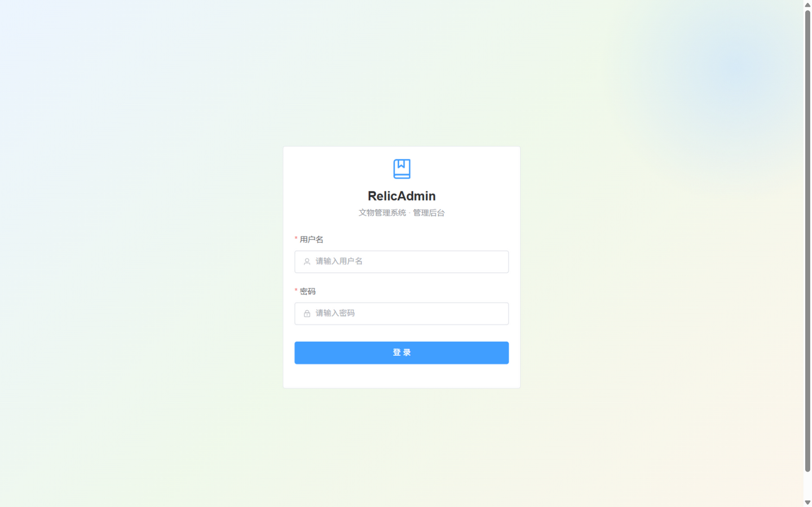
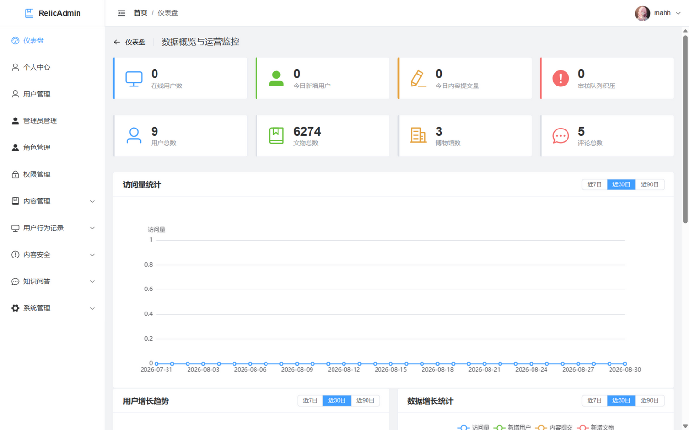
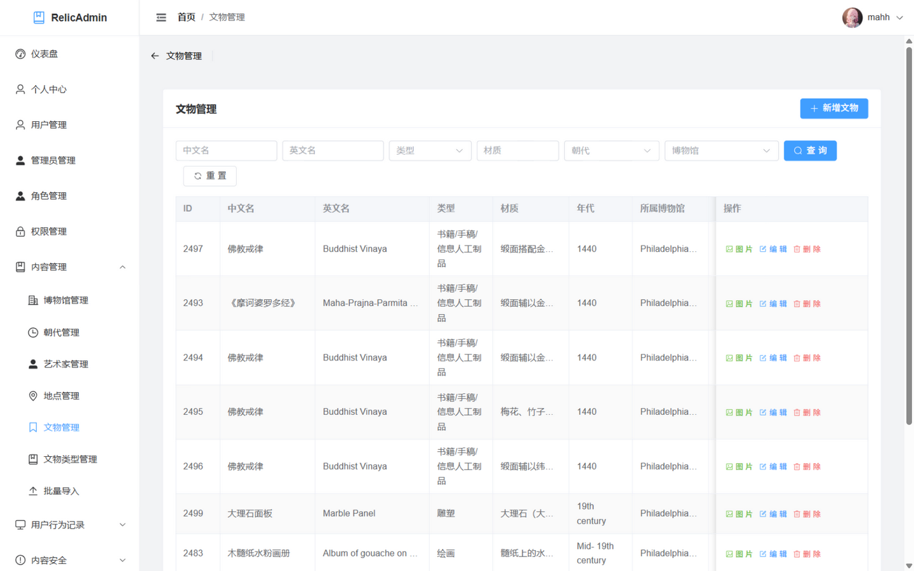
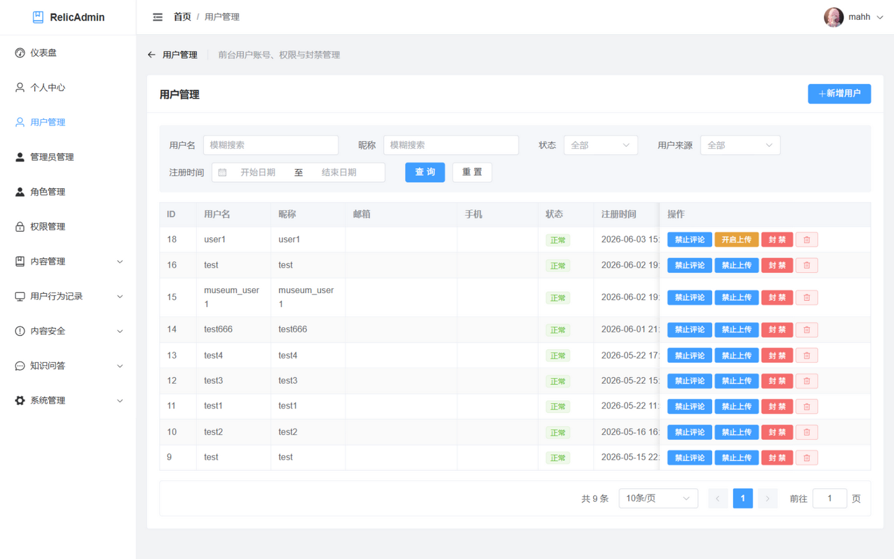
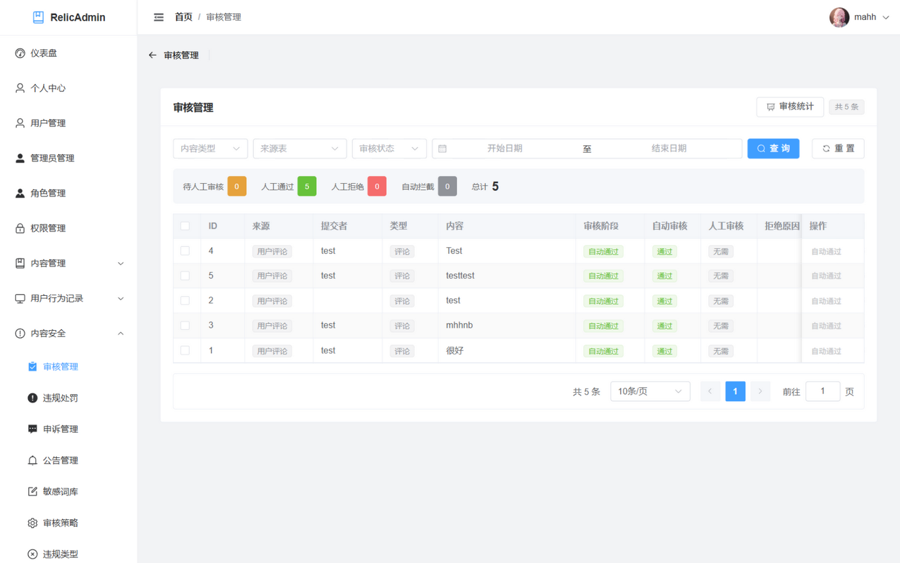
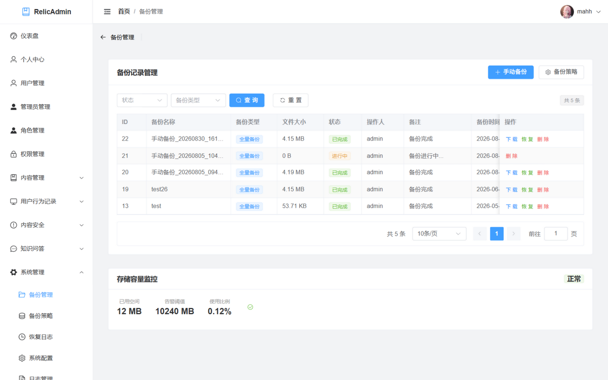
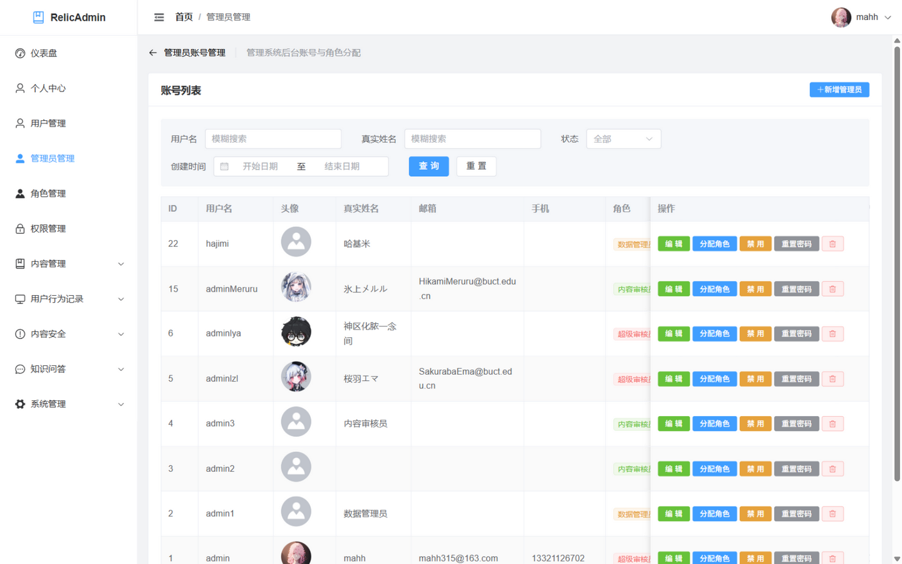
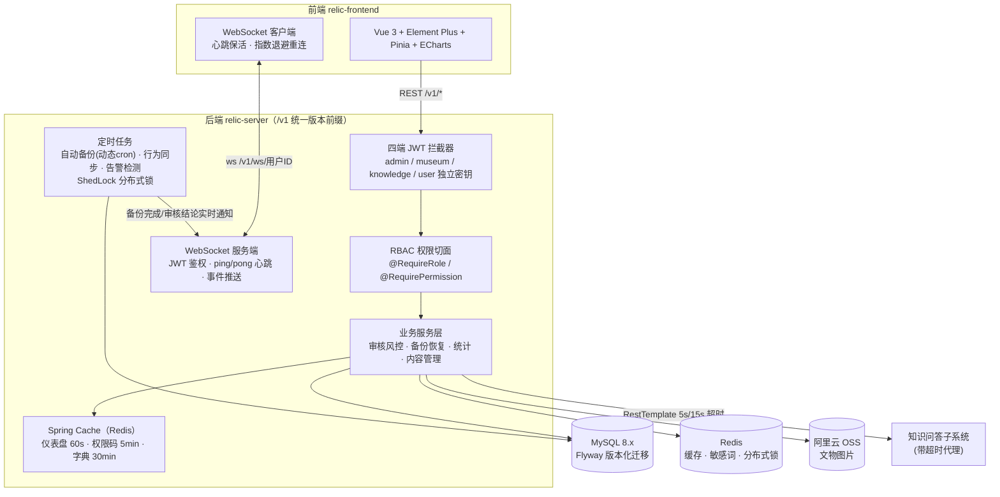

# RelicAdmin - 文物管理系统后台


RelicAdmin 是一个面向博物馆和文物管理机构的全栈后台管理系统，提供文物信息管理、用户行为监控、内容审核风控、数据备份恢复、知识问答对接等核心能力，支持**四端独立 JWT 鉴权**（管理端 / 博物馆端 / 知识问答端 / 用户端）与**注解驱动的 RBAC 权限控制**。

## 系统预览

| 登录 | 仪表盘 |
|:---:|:---:|
|  |  |
| **文物管理** | **用户管理** |
|  |  |
| **审核管理** | **备份管理** |
|  |  |
| **管理员与角色（RBAC）** | |
|  | |

## 项目架构



- **后端**：Spring Boot 3.2 提供 RESTful API，四端独立 JWT 鉴权；WebSocket 向在线管理端实时推送备份/审核事件
- **前端**：Vue 3 SPA，Vite 代理转发 API 请求（目标可用 `VITE_PROXY_TARGET` 覆盖），登录后自动建立长连接
- **数据库**：MySQL 8 + Flyway 自动迁移；Redis 承担热点缓存、敏感词库与 ShedLock 分布式锁
- **对象存储**：阿里云 OSS 存储文物图片等文件资源

## 技术栈

### 后端

| 技术 | 版本 | 用途 |
|------|------|------|
| Java | 21 | 运行环境 |
| Spring Boot | 3.2.12 | 应用框架 |
| MyBatis | 3.0.4 | ORM 框架 |
| MySQL | 8.x | 关系型数据库 |
| Flyway | - | 数据库版本化迁移 |
| Redis (Lettuce) | 7.x | 缓存 / 分布式锁 / 敏感词库 |
| WebSocket (jakarta) | - | 实时事件推送 |
| JWT (jjwt) | 0.11.5 | 四端独立令牌鉴权 |
| ShedLock + Redis | 5.16 | 定时任务分布式锁 |
| Spring Security Crypto | - | BCrypt 密码加密 |
| Druid | 1.2.23 | 数据库连接池 |
| Knife4j | 4.5.0 | API 文档 |
| Apache POI / OpenCSV | 5.2.5 / 5.9 | Excel/CSV 批量导入导出 |
| 阿里云 OSS SDK | 3.18.3 | 文件存储 |
| Lombok | 1.18.36 | 代码简化 |

### 前端

| 技术 | 版本 | 用途 |
|------|------|------|
| Vue | 3.4 | 前端框架（Composition API） |
| Vite | 6.x | 构建工具 |
| Element Plus | 2.14 | UI 组件库 |
| Pinia | 3.0 | 状态管理 |
| Vue Router | 4.6 | 路由管理 |
| Axios | 1.x | HTTP 客户端（拦截器统一鉴权/401 处理） |
| ECharts | 5.x | 数据可视化 |

## 功能模块

### 核心管理

| 模块 | 说明 |
|------|------|
| 仪表盘 | 在线用户、新增用户、内容提交量、审核积压等指标一屏总览，访问/增长趋势图（Redis 缓存 60s） |
| 用户管理 | 前台用户账号、来源筛选、注册时间查询、封禁/禁言/禁上传管理 |
| 管理员管理 | 后台账号 CRUD、角色分配；**防自删与最后一名超管保护** |
| 角色管理 | 角色标识配置与权限分配 |
| 权限管理 | 系统功能权限项（权限码）管理，供 RBAC 切面校验 |
| 个人中心 | 管理员个人信息与密码修改 |

### 内容管理

| 模块 | 说明 |
|------|------|
| 博物馆 / 朝代 / 艺术家 / 地点 / 文物类型管理 | 基础字典数据维护（读取走 30min 缓存） |
| 文物管理 | 文物 CRUD、多图管理、排序白名单防注入 |
| 批量导入 | CSV/Excel 上传、字段映射、预览确认、错误报告 |

### 用户行为记录

| 模块 | 说明 |
|------|------|
| 收藏 / 点赞 / 关注 | 用户互动行为记录查看与管理 |
| 动态 / 评论 / 上传 | UGC 内容管理 |
| 浏览历史 / 行为日志 | 自动采集的用户行为数据（定时扫描同步） |

### 审核与风控

| 模块 | 说明 |
|------|------|
| 审核管理 | 自动审核（敏感词命中即拦截）+ 人工复审、批量审核、拒绝原因必填校验 |
| 审核策略 | 按内容类型配置敏感词/图片检查开关 |
| 敏感词库 | 敏感词 CRUD、Redis 缓存加速（降级直查数据库） |
| 违规类型 / 违规处罚 / 申诉管理 | 处罚闭环：处罚 → 用户申诉（**属主校验**）→ 管理员复核 |

### 知识问答对接

| 模块 | 说明 |
|------|------|
| 问答日志 / 用户反馈 / 失败问题 | 问答子系统数据代理查看（参数 URL 编码、日志脱敏） |
| 审核任务 | 问答审核任务处理（通过/驳回/修复） |
| 问答统计 | 失败类型与不准确类型统计 |

### 系统运维

| 模块 | 说明 |
|------|------|
| 备份管理 | JDBC 流式导出防 OOM、可选 AES 加密、按记录下载/恢复（路径穿越防护） |
| 备份策略 | 自动备份开关与执行时间（**修改 cron 即时生效，无需重启**） |
| 恢复日志 | 数据恢复操作记录（含失败应急回滚提示） |
| 公告管理 / 系统配置 / 日志管理 | 系统公告、参数配置与操作/安全日志审计 |

## 工程亮点

- **注解驱动 RBAC**：`@RequireRole` / `@RequirePermission` + AOP 切面统一鉴权，权限码走「角色 → role_permissions → permissions」链路（Redis 缓存 5 分钟），替代散落各处的手工角色检查
- **四端独立 JWT**：管理/博物馆/问答/用户四端独立签名密钥与令牌头，WebSocket 握手同样强制校验且要求 sid 与 token 声明一致
- **实时事件推送**：备份完成/失败、审核结论等事件经 WebSocket 秒级触达在线管理端；客户端带 30s 心跳、1s→30s 指数退避重连，鉴权失败不重连
- **多 TTL 缓存体系**：Spring Cache + RedisCacheManager 按缓存名配置 TTL（仪表盘 60s / 权限码 5min / 字典 30min），字典缓存同时消除文物列表的 N+1 查询
- **可靠备份恢复**：流式 SQL 导出防大表 OOM、AES 加密可选、恢复前自动登记应急备份、失败提示回滚路径；自动备份 cron 动态读取策略表（改配置不重启），ShedLock 保证多实例不重复执行
- **安全实践**：BCrypt 密码哈希、登录 IP 限流 + 失败锁定、内容提交身份以 JWT 为准（拒绝客户端伪造 submitterId）、SQL 排序字段白名单、备份下载路径穿越防护、异常信息对外脱敏、CSP 安全响应头、密钥全部环境变量注入（不入库）
- **质量保障**：56 个单元测试（鉴权/越权/审核/恢复流程/工具类），含启动完整 Spring 上下文的冒烟测试

## 快速开始

### 前置条件

- **JDK 21+**
- **Node.js 18+**（推荐 20+）
- **Maven 3.8+**
- **MySQL 8.0+**
- **Redis 6.0+**

### 1. 克隆项目

```bash
git clone <repository-url>
cd RelicAdmin
```

### 2. 配置数据库与 Redis

修改 `relic-server/src/main/resources/application-dev.yml`（该文件不入库，本地新建即可，可参照 `application.yml` 中的占位符）：

```yaml
relic:
  datasource:
    host: your-mysql-host
    port: 3306
    database: your-database
    username: your-username
  redis:
    host: localhost
    port: 6379
```

数据库结构由 **Flyway 自动迁移**（`relic-server/src/main/resources/db/migration/`），首次启动自动建表，无需手工执行脚本。

### 3. 启动后端

```bash
# 首次运行先安装依赖模块（根 pom 为聚合模块、无主类）
mvn clean install -DskipTests
mvn spring-boot:run -pl relic-server
```

> **启动前必须配置环境变量**（密钥不入库，未配置时启动失败兜底）：
>
> | 环境变量 | 说明 |
> |------|------|
> | `JWT_ADMIN_SECRET_KEY` / `JWT_KNOWLEDGE_SECRET_KEY` / `JWT_MUSEUM_SECRET_KEY` / `JWT_USER_SECRET_KEY` | base64 密钥，≥32 字节 |
> | `MYSQL_PASSWORD` | 数据库密码 |
> | `OSS_ACCESS_KEY_ID` / `OSS_ACCESS_KEY_SECRET` | 阿里云 OSS 凭据 |
> | `BACKUP_ENCRYPT_KEY` | 可选，≥32 字符，启用备份文件 AES 加密 |

后端启动后（H-07 起接口带 `/v1` 版本前缀）：

- 应用地址：`http://localhost:8080/v1`
- API 文档（仅开发环境）：`http://localhost:8080/v1/doc.html`

### 4. 启动前端

```bash
cd relic-frontend
npm install
npm run dev
```

访问 `http://localhost:5173`，使用管理员账号登录。后端换端口时无需改代码：

```bash
VITE_PROXY_TARGET=http://localhost:8081 npm run dev
```

## 配置说明

配置文件位于 `relic-server/src/main/resources/`，采用 Spring Profile 机制：

| 文件 | 说明 |
|------|------|
| `application.yml` | 主配置（端口、数据源引用、MyBatis、JWT 引用、Flyway） |
| `application-dev.yml` | 开发环境配置（本地不入库） |
| `application-prod.yml` | 生产配置（密钥全部由部署平台注入，Swagger 关闭） |

### 前端配置

`relic-frontend/vite.config.js` 代理已匹配 `/v1` 前缀并开启 WebSocket 升级（`ws: true`）。
生产环境 API 地址通过 `.env.production` 的 `VITE_API_BASE` 覆盖（同域部署留空即可）。

> **生产部署注意**：反向代理需为 `/v1/ws/` 开启 WebSocket 升级头（`proxy_set_header Upgrade $http_upgrade; Connection "upgrade"`），否则实时推送不可用。

## API 文档

集成 Knife4j（OpenAPI 3），开发环境启动后端后访问：

```
http://localhost:8080/v1/doc.html
```

> 生产环境（prod profile）已关闭接口文档，防止暴露。

### API 路由结构（统一 `/v1` 版本前缀）

| 前缀 | 端 | 鉴权 |
|------|------|------|
| `/v1/admin/**` | 管理端 | JWT admin token + RBAC 切面 |
| `/v1/museum/**` | 博物馆端 | JWT museum token |
| `/v1/knowledge/**` | 知识问答端 | JWT knowledge token |
| `/v1/user/**` | 用户端 | JWT user token（登录/注册放行） |

## 测试

```bash
mvn test -pl relic-server -am
```

覆盖：JWT 工具、登录限流、敏感词检查、恢复流程（DML 批量/DDL 分治/应急回滚）、超级管理员与权限查询守卫、内容审核身份传递、申诉属主校验、认证流程，以及启动完整 Spring 上下文的冒烟测试。

## 项目结构

```
RelicAdmin/
├── relic-common/                  # 公共模块（常量/异常/Result/JWT 工具/配置属性）
├── relic-pojo/                    # 实体模块（dto / entity / vo）
├── relic-server/                  # 服务模块
│   └── src/main/java/com/relic/
│       ├── annotation/            # @RequireRole / @RequirePermission / @AutoFill / @OperationLog
│       ├── aspect/                # RBAC 权限切面、操作日志切面
│       ├── cache/                 # 缓存名常量（与 RedisConfiguration TTL 对应）
│       ├── config/                # Redis/CacheManager、OSS、WebSocket、动态备份调度等配置
│       ├── controller/            # admin / knowledge / museum / user 四端控制器
│       ├── handler/               # 全局异常处理（对外脱敏）
│       ├── interceptor/           # 四端 JWT 拦截器
│       ├── mapper/                # MyBatis Mapper
│       ├── service/               # 业务接口与实现
│       ├── task/                  # 定时任务（备份调度、行为同步、告警检测）
│       └── websocket/             # WebSocket 服务端（JWT 鉴权 + 心跳 + 事件推送）
│   └── src/main/resources/
│       ├── db/migration/          # Flyway 迁移脚本
│       └── mapper/                # MyBatis XML
├── relic-frontend/                # Vue 3 前端（api / views / stores / utils/websocket.js）
├── docs/                          # 项目文档与系统截图
└── pom.xml                        # 父 POM
```

## 贡献指南

1. Fork 本仓库
2. 创建功能分支：`git checkout -b feature/your-feature`
3. 提交变更：`git commit -m "Add your feature"`
4. 推送分支：`git push origin feature/your-feature`
5. 提交 Pull Request

### 开发规范

- 后端遵循 RESTful API 设计风格，统一 `Result<T>` 响应封装
- 数据库字段下划线命名，Java 驼峰命名（MyBatis 自动映射）
- 权限控制一律使用 `@RequireRole` / `@RequirePermission` 注解，不在业务代码中手工查角色表
- 操作日志通过 `@OperationLog` 注解 + AOP 自动记录
- 前端组件采用 Vue 3 Composition API（`<script setup>`），API 请求统一经 `src/api/` 封装
- 新增缓存须在 `CacheNames` 中登记缓存名，并在 `RedisConfiguration` 中配置对应 TTL

## 许可证

本项目仅供学习和教学使用。

## 联系方式

| 成员 | 角色 |
|------|------|
| 马虎虎 | 项目负责人 / 后端开发 |
| 叶叶新 | 后端开发 |
| 李泽林 | 前端开发 |
| 李昱昂 | 前端开发 |
| 李兴冉 | 测试 |
